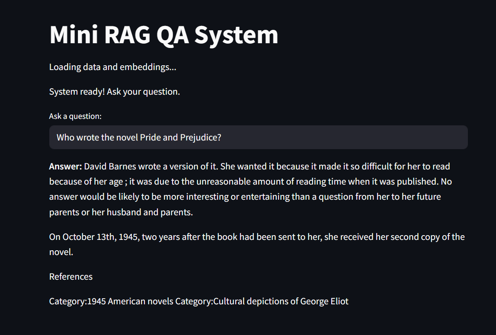

# Mini RAG QA System

A small Retrieval-Augmented Generation system using Hugging Face Transformers, FAISS, and Streamlit.

## Installation

```bash
pip install -r requirements.txt
```

## How to run this project

```bash
streamlit run app.py
```

## Result


